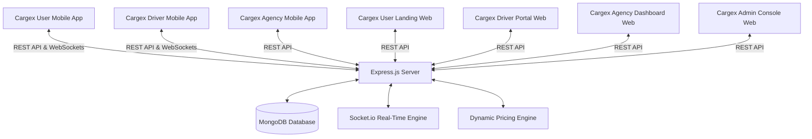

# Cargex Unified Logistics Platform
## Systems, Architecture & Workflow Documentation

Welcome to the **Cargex** system documentation. Cargex is a premium, real-time logistics partner platform that connects customers, drivers, and transport agencies via web portals and mobile applications powered by a single high-performance real-time backend engine.

---

## 1. High-Level System Architecture

Cargex is designed as a decoupled, microservices-ready client-server architecture. All clients (web and mobile) communicate with the central Express.js backend via **REST APIs** for static/transactional actions and **Socket.io WebSockets** for real-time dispatch streams, live map tracking, and instant chats.



---

## 2. The 3 Mobile Apps (React Native + Expo)

All three mobile apps are built using **React Native**, compiled with **Expo (EAS)**, and leverage a unified styled component library (Tailored dark modes, curated HSL color schemes, Outfit fonts, and Lucide vector icons).

### A. Cargex User App (`cargex-user app`)
The user-facing mobile application guides customers through creating and tracking cargo shipments.
* **Step-by-step Booking Flow**:
  1. **Cargo Category**: Select broad shipping classifications (e.g., *Household Goods*, *Construction Material*, *Heavy Equipment*).
  2. **Cargo Details**: Specify exact cargo subclassifications (e.g., *Cement*, *Bricks*, *Furniture*) and choose a weight limit segment (*Small*, *Medium*, *Heavy*).
  3. **Address Routing**: Input pickup/dropoff locations with full auto-complete suggestions (Nominatim OpenStreetMap API) and compute distance/travel duration (OSRM Routing Engine).
  4. **Select Vehicle**: View recommended vehicles matching cargo weights and read server-side estimated fares.
  5. **Review & Request**: Choose payment methods (*Cash*, *UPI*, *Wallet*), request loaders/helpers, and broadcast the dispatch.
* **Live Tracking Screen**: Real-time visual map tracking showing the assigned driver's live GPS coordinates, status badges, vehicle number plates, and chat portals.
* **Booking History**: Logs past, active, and cancelled orders.

### B. Cargex Driver App (`cargex-driver app`)
The partner-facing mobile application coordinates driver routines, accepts orders, and assists navigation.
* **Online/Offline Status Toggle**: Streams driver availability to the dispatch pool. When online, updates coordinate entries in the database.
* **Available Dispatches Feed**: Listens to real-time `new_ride_request` broadcasts matching the driver's vehicle type. Displays pickup/dropoff addresses, cargo category, mileage, customer details, and payout figures.
* **Active Queue (Bookings Section)**: Displays accepted dispatches.
* **Trip Details & Navigation Screen**:
  * Integrates maps showing route lines from current location to pickup/dropoff points.
  * Hides the customer's secure verification codes (OTPs) from the driver screen, forcing the driver to ask the customer verbally at check-in/out.
  * Taps **Start Trip (Verify OTP)** or **Complete Trip (Verify OTP)** to trigger entry modals.
* **Document Vetting**: Allows uploading profile pictures, driving licenses, and vehicle Registration Certificates (RCs). Files are pushed to Cloudinary/S3 storage via API.

### C. Cargex Agency App (`cargex-agency app`)
The agency companion application acts as a light mobile supervisor dashboard for transport fleets.
* **Vehicle Roster**: View available trucks, capacities, and active driver associations.
* **Driver Oversight**: Monitor online statuses, active routes, and performance ratings.
* **Earnings Report**: View breakdown summaries of consolidated payouts, commissions, and transaction logs.

---

## 3. Web Dashboards (Next.js / React)

Web portals are built using Next.js to provide optimized rendering, SEO structure, and secure cookie-based session handling.

* **Admin Console (`cargex-admin`)**:
  * **Driver Vetting System**: Inspect uploaded driving licenses, profile pictures, and vehicle RCs. Approve or reject drivers to unlock their app login.
  * **Dynamic Pricing Configurator**: Configure base fares, per-km rates, load charge weights, vehicle type multipliers, and surge overrides.
  * **Real-time Map Monitor**: View live coordinates of all online drivers on a centralized map.
* **Agency Dashboard (`cargex-agency`)**:
  * Fleet registration, driver onboarding, and weekly invoice downloads.
* **User Web (`cargex-user`) & Driver Web (`cargex-driver`)**:
  * Marketing landing pages, registration forms, terms of service, and support tickets.

---

## 4. Backend Engine & Real-Time Communications

The backend service (`server`) is built with Express.js and MongoDB. It acts as the orchestrator of all transactions and communications.

### Real-Time Socket.io Events
Sockets handle low-latency updates. When clients connect, they join specific security rooms:
* **`join_user(userId)`**: Joins user to private socket room `user_userId` to receive status updates.
* **`join_driver(driverId)`**: Joins driver to private `driver_driverId` room and streams status updates. Online drivers also join the global `available_drivers` room.
* **`new_ride_request`**: Fired from the backend when a user completes a booking. Broadcasts a payload to `available_drivers` and targeted nearby drivers matching the required vehicle type.
* **`driver_location_update(data)`**: Fired by the driver app as they drive. The backend streams this live location to the assigned booking's private socket room, updating the user's tracking map in real time.
* **`send_message(data)` / `receive_message(data)`**: Powers the chat room between user and driver.

### Dynamic Pricing Engine
Server-side pricing calculates booking costs dynamically:
$$\text{Total Fare} = \left( (\text{Base Fare} + (\text{Distance} \times \text{Per-Km Rate}) + \text{Load Charges}) \times \text{Vehicle Multiplier} \times \text{Surge Multiplier} \right) + \text{Night Surcharge}$$

* **Surge Multiplier**: Calculated in real-time based on local demand:
  $$\text{Surge Ratio} = \min\left(1.5, \max\left(1.0, \frac{\text{Active Bookings}}{\text{Online Drivers}}\right)\right)$$
* **Night Surcharge**: Applies a $+20\%$ surcharge between 22:00 and 06:00.

---

## 5. End-to-End Booking & Dispatch Workflow

```
[Customer User App]                      [Express Backend]                     [Driver App]
         |                                       |                                   |
         |--- 1. Request Booking (POST) -------->|                                   |
         |                                       |--- 2. Calculate Fare Breakdown    |
         |                                       |--- 3. Create Booking (Requested)  |
         |                                       |                                   |
         |<-- 4. Return Created Booking Details -|                                   |
         |                                       |--- 5. Broadcast (Socket.io) ----->| (new_ride_request)
         |                                       |       to available drivers        |
         |                                       |                                   |
         |                                       |                                   |--- 6. Accept Dispatch (POST)
         |                                       |                                   |
         |                                       |<-- 7. Update status to 'accepted' |
         |<-- 8. Broadcast Status (Socket.io) ---|                                   |
         |       (driver_assigned / arrived)     |                                   |
         |                                       |                                   |--- 9. Arrive at Pickup Location
         |                                       |                                   |
         |                                       |                                   |--- 10. Ask customer for Pickup OTP
         |--- 11. Read OTP (e.g. 4392) --------->|                                   |
         |                                       |                                   |--- 12. Input OTP (e.g. 4392)
         |                                       |<-- 13. Validate & Start Trip -----|
         |<-- 14. Trip Started (Socket.io) ------|                                   |
         |                                       |                                   |
         |                                       |<-- 15. Stream GPS coordinates ----| (driver_location_update)
         |<-- 16. Update Live Map Pin -----------|                                   |
         |                                       |                                   |
         |                                       |                                   |--- 17. Arrive at Dropoff Location
         |                                       |                                   |
         |                                       |                                   |--- 18. Ask customer for Drop OTP
         |--- 19. Read OTP (e.g. 8831) --------->|                                   |
         |                                       |                                   |--- 20. Input OTP (e.g. 8831)
         |                                       |<-- 21. Validate & Complete Trip---|
         |<-- 22. Trip Completed ----------------|                                   |
         |        Show Payment Summary           |                                   |
```

1. **Booking Placement**: The customer user app computes a route and posts details to `/api/users/bookings`.
2. **Dynamic Payout & Storage**: The backend calculates pricing parameters, generates two random verification codes (`pickupOtp` and `dropOtp`), saves the document with status `requested`, and triggers a Socket.io broadcast.
3. **Dispatch Notification**: The backend notifies nearby drivers matching the vehicle requirement.
4. **Driver Acceptance**: A driver views the request under *Available Dispatches* and taps **Accept**. The backend updates the booking to `accepted` and assigns the driver.
5. **Real-time Map Synchronization**: The driver app streams GPS updates. The customer app tracking screen listens to the broadcast and repositions the driver's map pin in real time.
6. **Pickup OTP Verification**: The driver arrives at the pickup address. The customer verbally shares their `pickupOtp` (which is visible on the customer's tracking screen but hidden from the driver's screen). The driver enters the OTP. Once validated, the status changes to `in_progress`.
7. **Dropoff OTP Verification**: Upon arrival at the destination, the driver asks for the `dropOtp`. Entering the correct code completes the booking, triggers payment captures, updates driver earnings, and ends the trip.
